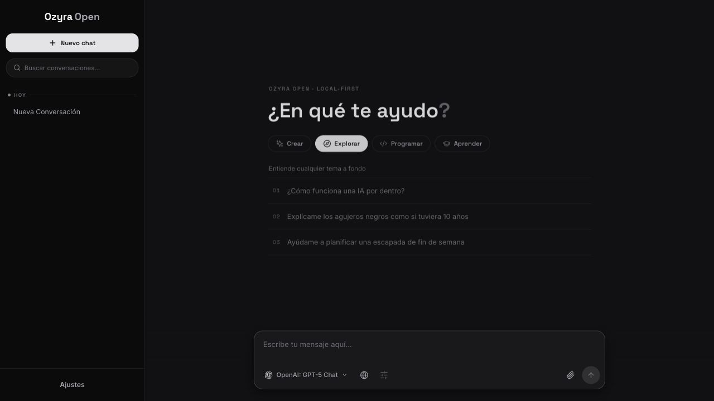
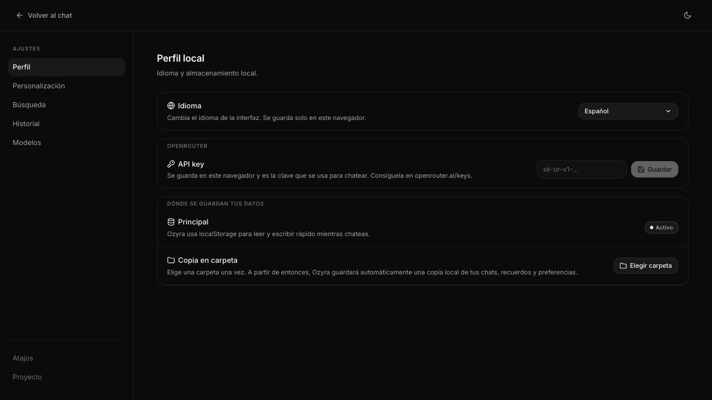

# Ozyra Open

Chat local-first con React, TypeScript y OpenRouter.

Ozyra Open guarda tus conversaciones en el navegador y llama a los modelos desde
el cliente. No necesita Supabase, login ni una base de datos propia.

## Capturas





## Qué ofrece

- Conversaciones locales con importación y exportación en JSON.
- Streaming de respuestas desde OpenRouter.
- Selector de modelos con catálogo local y sincronización opcional.
- Markdown, adjuntos de imagen, razonamiento visible y búsqueda web opcional.
- Copia local a carpeta cuando el navegador soporta File System Access API.

## Arranque

Requisitos: Node.js 20+, npm 10+ y una clave de OpenRouter.

```bash
npm install
cp .env.example .env.local
npm run dev
```

Abre `http://localhost:5173` y guarda la clave en `Ajustes > Perfil local`.

## Seguridad

Las variables `VITE_` y cualquier clave guardada desde la UI viven en el
navegador. Usa esta app como cliente local-first: no metas secretos privados en
`.env.local` que no quieras exponer al frontend.

Las claves opcionales de Tavily o Brave Search también viven en el navegador.
Para una instancia pública compartida conviene usar claves con límites de gasto o
añadir un backend propio con cuotas.

## Scripts

```bash
npm run dev
npm run validate
npm run build
```

`validate` ejecuta type-check, lint, formato y tests.

## Más

La guía compacta está en [docs/README.md](docs/README.md).

MIT License. Consulta [LICENSE](LICENSE).
