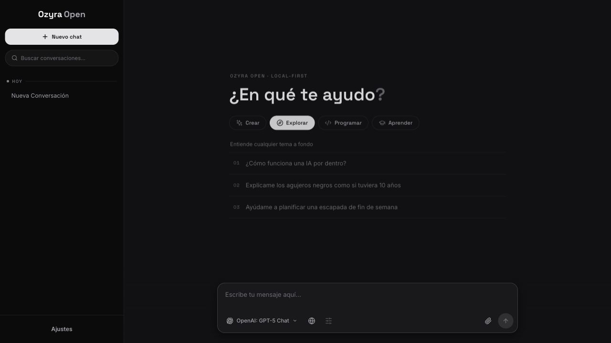
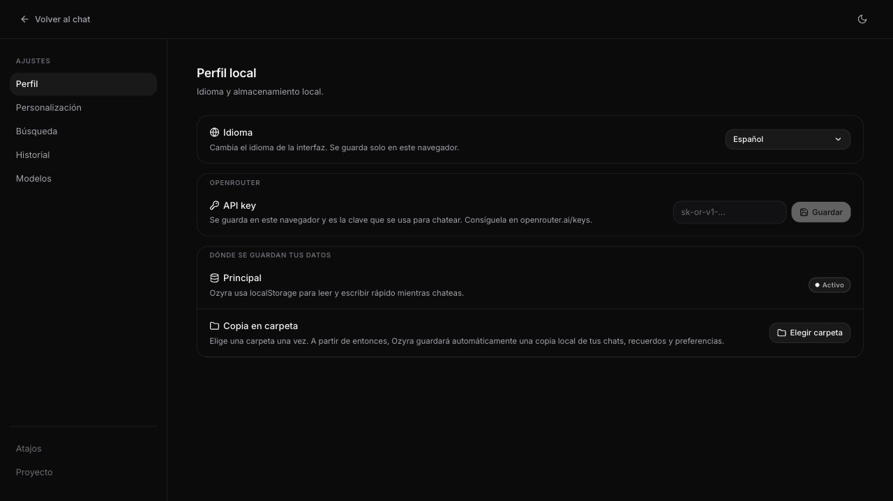

# Ozyra Open

[](https://github.com/DavidPerezA12/OzyraOpen/actions/workflows/ci.yml)
[](LICENSE)
[](CONTRIBUTING.md)

**Español: [README.es.md](README.es.md)**

A local-first chat client built with React, TypeScript, and OpenRouter.

Ozyra Open stores your conversations in the browser and calls the models
directly from the client. No Supabase, no login, no backend database required.

## Screenshots





## Features

- Local conversations with JSON import and export.
- Streaming responses from OpenRouter.
- Model selector with a local catalog and optional sync.
- Markdown, image attachments, visible reasoning, and optional web search.
- Automatic local folder backup when the browser supports the File System
  Access API.
- Interface available in English, Spanish, French, and German.

## Getting started

Requirements: Node.js 20+, npm 10+, and an OpenRouter API key.

```bash
npm install
cp .env.example .env.local
npm run dev
```

Open `http://localhost:5173` and save your key in `Settings > Local profile`.

## Security

`VITE_` variables and any key saved from the UI live in the browser. Use this
app as a local-first client: do not put private secrets in `.env.local` that
you would not want exposed to the frontend.

Optional Tavily or Brave Search keys also live in the browser. For a shared
public instance, use keys with spending limits or add your own backend with
quotas. See [SECURITY.md](SECURITY.md) for the vulnerability reporting policy.

## Scripts

```bash
npm run dev
npm run validate
npm run build
```

`validate` runs type-check, lint, format check, and tests.

## Contributing

Contributions are welcome! See [CONTRIBUTING.md](CONTRIBUTING.md) for local
setup, checks, and pull request guidelines.

## More

A compact architecture guide lives in [docs/README.md](docs/README.md).

MIT License. See [LICENSE](LICENSE).
